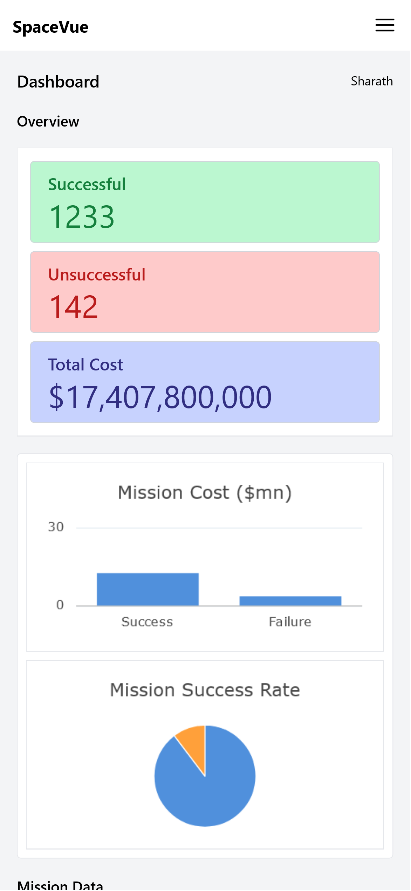

# SpaceVue

SpaceVue is a React 18 application providing information about space missions. It includes various components for mission data visualization and mission summary views.

## Live Demo

Check out the live demo of SpaceVue: [SpaceVue Demo](https://space-vue-wm.netlify.app/)

[](https://app.netlify.com/sites/space-vue-wm/deploys)

> [!TIP]
> Use the following credentials to login: **Username**: `admin` & **Password**: `admin`

## Overview

SpaceVue is a comprehensive space mission dashboard that features mission data visualization through charts and tables, providing an insightful overview of space exploration.

## Designs

### Wireframe


### Draw.io File

For a detailed view, you can check the [SpaceVue.drawio](docs/SpaceVue.drawio) file.

## Screenshot

| Desktop                                  | Mobile                                            |
| ---------------------------------------- | ------------------------------------------------- |
|  |  |

## API and Sample Data

The space mission data is fetched from the following API:

- API: [Space Mission API](https://www.ag-grid.com/example-assets/space-mission-data.json)

Here is a sample of the data:

```json
[
  {
    "mission": "CRS SpX-25",
    "company": "SpaceX",
    "location": "LC-39A, Kennedy Space Center, Florida, USA",
    "date": "2022-07-15",
    "time": "0:44:00",
    "rocket": "Falcon 9 Block 5",
    "price": 12480000,
    "successful": true
  },
  {
    "mission": "LARES 2 & Cubesats",
    "company": "ESA",
    "location": "ELV-1, Guiana Space Centre, French Guiana, France",
    "date": "2022-07-13",
    "time": "13:13:00",
    "rocket": "Vega C",
    "price": 4470000,
    "successful": true
  }
  // ... (more mission data)
]
```

## Setup

1. **Clone the repository:**

   ```bash
   git clone https://github.com/shaarkr/space-vue.git
   cd space-vue
   ```

2. **Install dependencies:**

   ```bash
   npm install
   ```

3. **Run the application:**

   ```bash
   npm run dev
   ```

   The app will be accessible at [http://localhost:5173](http://localhost:5173).

## Dependencies

- ag-charts-react: ^9.0.1
- ag-grid-react: ^31.0.1
- react: ^18.2.0
- react-dom: ^18.2.0
- react-router-dom: ^6.21.1

## Resources

- AG-Grid Documentation: [AG-Grid](https://www.ag-grid.com/)
- AG-Charts Documentation: [AG-Charts](https://charts.ag-grid.com/)

## Scripts

- **dev:** Run the development server.
- **build:** Build the production-ready application.
- **lint:** Run ESLint for code linting.
- **preview:** Preview the production build.

## Contributors

- [@shaarkr](https://github.com/shaarkr)

Feel free to contribute to SpaceVue by submitting issues or pull requests.

## License

This project is licensed under the MIT License - see the [LICENSE](LICENSE) file for details.
